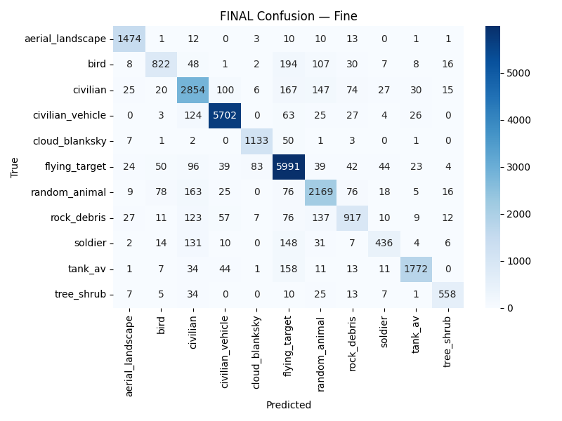

# Drone Target Identification Model

An end-to-end deep-learning pipeline for drone- and camera-based target identification. It unifies
heterogeneous public image datasets, trains a multi-output CNN that predicts both a fine-grained
object class and a coarse valid/invalid label, and embeds the trained classifier behind a YOLO
segmentation front-end for real-time video.

Project page: **[loganmedwardsastrophy.com/drone-target.html](https://www.loganmedwardsastrophy.com/drone-target.html)**

## Results

Held-out test set: **27,362 samples** across 11 fine classes. Naïve single-class baselines reach
23.52% (fine) and 34.50% (coarse), so both heads have to learn real structure to be useful.

| Head | Accuracy | Macro F1 | Baseline |
|---|---|---|---|
| Fine (11-way) | **87.08%** | 0.8358 (P 0.8570 / R 0.8208) | 23.52% |
| Coarse (3-way valid/invalid) | **91.31%** | 0.9129 (P 0.9128 / R 0.9130) | 34.50% |

<p align="center">
  
</p>

Per-class precision is strongest on visually distinct categories (`civilian_vehicle` 0.954,
`tank_av` 0.943, `aerial_landscape` 0.931) and weakest where classes share appearance
(`rock_debris` 0.755, `soldier` 0.773, `civilian` 0.788). Full breakdowns, including per-class recall
and both confusion matrices, are in [`results/test_detailed_metrics.txt`](results/test_detailed_metrics.txt).

### Which run these numbers come from

The architecture was trained at several input resolutions. The figures above — and the ones on the
project page — are the **256 × 256 / 20-epoch** run, and `results/` at the top level holds that run's
artifacts.

[`results/resolution-study-128x128/`](results/resolution-study-128x128) holds the **128 × 128 /
50-epoch** run for comparison: 87.62% fine / 91.17% coarse on the same 27,362-sample test set. The
two land within a few tenths of a point of each other, which is what "differences negligible" in the
original folder names refers to. 64 × 64 was clearly worse and 256 × 256 added very little over
128 × 128, so for offline classification 128 × 128 is the sweet spot on cost.

## Pipeline

Three modular stages, each independently runnable.

| Stage | Script | Notebook | What it does |
|---|---|---|---|
| 1. Dataset builder | [`src/build_dataset.py`](src/build_dataset.py) | [`01_cataloguing_pipeline`](notebooks/01_cataloguing_pipeline.ipynb) | Pulls images from KaggleHub sources, reorganizes them into a single `images/` tree and a unified `metadata.csv`, hash-dedupes, and aliases dataset-specific terms onto canonical labels. |
| 2. Training | [`src/train_model.py`](src/train_model.py) | [`02_training_testing_network`](notebooks/02_training_testing_network.ipynb) | Trains the multi-output CNN (fine + coarse heads), writes confusion matrices, classification reports and training curves. |
| 2b. Evaluation | [`src/evaluate_model.py`](src/evaluate_model.py) | (same notebook, 2nd cell) | Detailed test metrics for a trained checkpoint: per-class accuracy, micro/macro/weighted P/R/F1, confusion matrices. |
| 3. Real-time | [`src/realtime_yolo_classifier.py`](src/realtime_yolo_classifier.py) | [`03_video_implementation`](notebooks/03_video_implementation.ipynb) | YOLO segmentation produces per-frame instance masks; each mask is cropped, normalized to match training, classified, and overlaid on the source frame in the predicted coarse label's colour. |

### Labels

11 fine classes map onto 3 coarse validity buckets (see [`models/label_map.json`](models/label_map.json)):

- **valid** — `soldier`, `tank_av`, `flying_target`
- **invalid_nontarget** — `civilian`, `civilian_vehicle`
- **invalid_background** — `aerial_landscape`, `cloud_blanksky`, `tree_shrub`, `rock_debris`, `random_animal`, `bird`

The live overlay consults only the coarse head: the operational question is "valid target?". `valid`
renders green, `invalid_nontarget` red, and `invalid_background` is suppressed entirely.

## Model

A compact multi-output ConvNet: `Conv → BatchNorm → ReLU → MaxPool` blocks with growing channel
depth (32 → 64 → 128), then a shared dense trunk that feeds two softmax heads (11-way fine, 3-way
coarse). Both heads are optimized jointly with categorical cross-entropy and configurable per-head
weights; dropout and L2 regularization mitigate overfitting, with AdamW and a plateau-triggered LR
schedule.

Sample weights down-weight over-represented classes (notably `invalid_background`). Setting
`IGNORE_INVALID_IN_FINE = True` makes invalid examples train only the coarse head, freeing the fine
head to focus on examples with meaningful fine labels.

**Input resolution.** Going from 64×64 to 128×128 improved both heads substantially; 256×256 added
very little. For the live video pipeline, *lower*-resolution crops actually helped — they kept the
YOLO + CNN loop closer to real time and improved detection of small, distant targets.

## Data

The unified training corpus is published on Kaggle:
**[loggger/fpv-images](https://www.kaggle.com/datasets/loggger/fpv-images)** (~272k labeled paths
collected, 182,413 samples used after balancing and de-duplication).

`src/build_dataset.py` downloads it via `kagglehub` and rebuilds the corpus locally.

## Trained weights

[`models/best_model_32x32.h5`](models/best_model_32x32.h5) (7.2 MB) is the 32×32 classifier used by
the real-time video pipeline — the low-resolution crops that kept the YOLO + CNN loop closest to real
time. [`models/label_map.json`](models/label_map.json) is the matching class map.

The offline checkpoints are too large for the repository: the 256 × 256 run behind the headline
numbers is ~385 MB, and the 128 × 128 run is ~97 MB. Rebuild either with `src/train_model.py` by
setting `IMAGE_SIZE` accordingly, or ask for a copy.

## Running it

```bash
pip install -r requirements.txt
```

```bash
python src/build_dataset.py --out data_kagglehub_unified --images-per-class 1000 --size 128
```

```bash
DATA_ROOT=data_kagglehub_unified python src/train_model.py
```

```bash
python src/realtime_yolo_classifier.py --source 0 --model models/best_model_32x32.h5 --label-map models/label_map.json
```

`--source` accepts a webcam index as a string (`"0"`) or a path to a video file. `--yolo-weights`
defaults to `yolov8n-seg.pt`; any YOLO *segmentation* checkpoint works.

The training and evaluation scripts read their dataset root from the `DATA_ROOT` environment
variable, defaulting to `./data_kagglehub_unified`.

## Limitations

- **Borderline crops.** Segmentation masks that mix target and background pixels; when background
  dominates the crop the classifier defaults to an invalid label even when part of a target is visible.
- **Small or occluded targets.** Distant or partially blocked objects give too few pixels for a
  confident fine-class prediction.
- **Visually similar classes.** `soldier` vs `civilian`, `bird` vs `random_animal`, and
  `invalid_nontarget` vs `invalid_background` account for most off-diagonal confusion-matrix mass.

## Repository layout

```
src/         runnable stage scripts
notebooks/   the original Colab notebooks (outputs stripped)
results/     the published 256x256 run: confusion matrix, curves, reports, full metrics
  resolution-study-128x128/   the same artifacts for the 128x128 run
models/      real-time classifier weights + label map
docs/        full technical report (PDF)
```

### Provenance

`notebooks/` holds the original Colab notebooks verbatim, with execution outputs stripped and
nothing else changed. `src/` is the same code lifted out of those cells, with exactly three edits:

- `train_model.py`, `evaluate_model.py` — `DATA_ROOT` now reads the `DATA_ROOT` environment variable
  and defaults to `./data_kagglehub_unified`, instead of a hard-coded `C:\Users\Owner\...` path.
- `realtime_yolo_classifier.py` — the `--model`, `--label-map` and `--source` argparse defaults point
  at relative paths instead of hard-coded local ones. The originals are kept in comments.
- `build_dataset.py` — the entry point calls `main()` rather than `main(argv=[])`, so command-line
  arguments are honoured when the file is run as a script.
- `build_dataset.py` — the JPEG quality default is written as `100` instead of `512`. JPEG quality is
  defined over 1–100; libjpeg silently clamps anything higher, so the corpus was always encoded at
  100 and the output is byte-for-byte unchanged. The literal now states what actually happened.

Every other byte matches the notebooks.

## Report

[`docs/Drone_Targeting_Model_Pipeline_Report.pdf`](docs/Drone_Targeting_Model_Pipeline_Report.pdf) —
full methodology, dataset construction, and error analysis.

## License

MIT — see [LICENSE](LICENSE).
